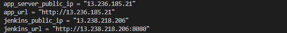
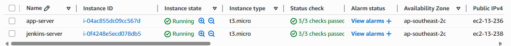
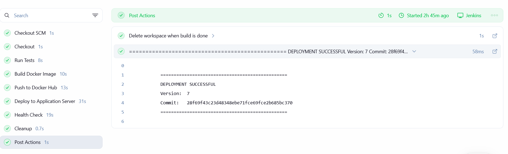
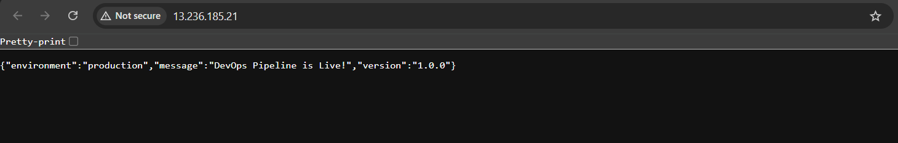
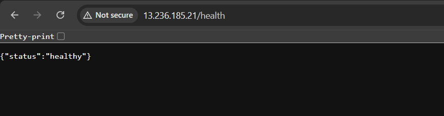

# DevOps Deployment Pipeline

## What This Project Does
This project automates the process of building servers and deploying application using CI/CD pipeline in a cloud native environment. This eliminates the manual process and human errors normally encountered during the build and deployment process and significally reduces the time it takes to take an application to be up and running.

## Architecture
```
Developer (Local Machine)
        │
        │  git push
        ▼
    GitHub Repository
        │
        │  webhook trigger (on every push)
        ▼
  Jenkins Server (EC2)
        │
        ├── 1. Pull code from GitHub
        ├── 2. Run pytest tests
        ├── 3. Build Docker image
        ├── 4. Push image to Docker Hub
        │
        │  AWS SSM Run Command (no SSH required)
        ▼
  App Server (EC2)
        │
        ├── Pull Docker image from Docker Hub
        ├── Stop old container
        ├── Start new container on port 80
        └── Health check confirms deployment
```

---


## Tech Stack
| Tool | Purpose | Why I chose it |
|------|---------|----------------|
| AWS EC2 | Cloud servers | Free tier, industry standard |
| Terraform | Infrastructure as Code | Reproducible, version controlled infrastructure |
| Ansible | Configuration management | Agentless, idempotent server configuration |
| Jenkins | CI/CD | Industry standard, full control |
| Docker | Containerization | Consistent environments across all machines |
| GitHub | Version control + webhooks | Source of truth, triggers pipeline |

## Prerequisites
Before setting up this project you will need the following:

**Accounts:**
- AWS account (free tier) — [Create here](https://aws.amazon.com/free)
- Docker Hub account — [Create here](https://hub.docker.com)
- GitHub account — [Create here](https://github.com)

**Local machine (Windows with WSL2):**
- WSL2 with Ubuntu installed
- Terraform installed inside WSL2
- Ansible installed inside WSL2
- AWS CLI installed and configured inside WSL2
- An AWS EC2 Key Pair (.pem file) saved to `~/.ssh/`

---

## Setup Instructions

### 1. Clone the Repository

```bash
git clone https://github.com/jecasan/devops-deployment-project.git
cd devops-deployment-project
```

### 2. Configure AWS Credentials

```bash
aws configure
# Enter your AWS Access Key ID
# Enter your AWS Secret Access Key
# Default region: ap-southeast-2
# Default output format: json

# Verify it works
aws sts get-caller-identity
```

### 3. Provision Infrastructure with Terraform

```bash
# Navigate to the terraform directory
cd terraform/

# Create your tfvars file (this file is gitignored — never commit it)
cat > terraform.tfvars << EOF
aws_region    = "ap-southeast-2"
key_pair_name = "your-key-pair-name"
your_ip       = "$(curl -s ifconfig.me)/32"
instance_type = "t3.micro"
EOF

# Initialize Terraform
terraform init

# Preview what will be created
terraform plan

# Create the infrastructure
terraform apply
# Type yes when prompted

# Note the output IPs — you will need these for Ansible
terraform output
```

This creates:
- 2 EC2 instances (Jenkins server and App server)
- 2 Security groups with appropriate port rules
- IAM role and policy for SSM access
- IAM instance profile attached to both EC2 instances

### 4. Configure Servers with Ansible

```bash
# Navigate to the ansible directory
cd ../ansible/

# Update inventory.ini with the IPs from terraform output
# Replace JENKINS_IP and APP_IP with your actual IPs
cat > inventory.ini << EOF
[jenkins]
JENKINS_IP ansible_user=ubuntu ansible_ssh_private_key_file=~/.ssh/your-key.pem

[app_servers]
APP_IP ansible_user=ubuntu ansible_ssh_private_key_file=~/.ssh/your-key.pem

[all:vars]
ansible_python_interpreter=/usr/bin/python3
ansible_ssh_common_args='-o StrictHostKeyChecking=no'
EOF

# Test connectivity to both servers
ansible all -i inventory.ini -m ping

# Run the full playbook to configure both servers
ansible-playbook -i inventory.ini playbook.yml
```

The playbook automatically installs on Jenkins server:
- Docker
- Jenkins
- Java 17
- Python3, pip, venv
- AWS CLI
- AWS SSM Agent
- Git
- 2GB swap memory

The playbook automatically installs on App server:
- Docker
- AWS SSM Agent

### 5. Configure Jenkins

**Get the initial admin password:**
```bash
ansible jenkins -i inventory.ini \
  -m command \
  -a "cat /var/lib/jenkins/secrets/initialAdminPassword" \
  --become
```

**Open Jenkins in your browser:**
```
http://YOUR_JENKINS_IP:8080
```

**Complete setup:**
1. Paste the initial admin password
2. Click **Install suggested plugins** and wait for completion
3. Create your admin user account
4. Keep the Jenkins URL as default and click **Save and Finish**

**Install required plugin:**
1. **Manage Jenkins** → **Plugins** → **Available plugins**
2. Search `GitHub` → install **GitHub plugin**
3. Search `SSH Agent` → install **SSH Agent plugin**
4. Restart Jenkins when prompted

**Add credentials:**

Go to **Manage Jenkins** → **Credentials** → **System** → **Global credentials** → **Add Credentials**

| ID | Kind | What to enter |
|----|------|---------------|
| `docker-token` | Username with password | Docker Hub username and password |
| `git-hub-credentials` | Username with password | GitHub username and Personal Access Token |

**Configure GitHub integration:**
1. **Manage Jenkins** → **Configure System**
2. Scroll to **GitHub** section
3. Click **Add GitHub Server**
4. Name: `GitHub`, API URL: `https://api.github.com`
5. Credentials: select `git-hub-credentials`
6. Click **Test connection** — should say credentials verified
7. Check **Manage hooks**
8. Click **Save**

**Create the pipeline job:**
1. **New Item** → name it `DevOps-Deployment Project` → select **Pipeline** → OK
2. Check **GitHub project** → enter `https://github.com/jecasan/devops-deployment-project/`
3. Under **Build Triggers** → check **GitHub hook trigger for GITScm polling**
4. Under **Pipeline** → select **Pipeline script from SCM**
5. SCM: **Git**
6. Repository URL: `https://github.com/jecasan/devops-deployment-project.git`
7. Credentials: select `git-hub-credentials`
8. Branch: `*/main`
9. Script Path: `jenkins/Jenkinsfile`
10. Click **Save**

### 6. Configure GitHub Webhook

1. Go to your GitHub repository → **Settings** → **Webhooks** → **Add webhook**
2. Payload URL: `http://YOUR_JENKINS_IP:8080/github-webhook/`
3. Content type: `application/json`
4. Events: select **Just the push event**
5. Check **Active**
6. Click **Add webhook**

### 7. Trigger Your First Deployment

```bash
# Make a small change to trigger the pipeline
echo "# First deployment test" >> README.md
git add README.md
git commit -m "trigger: first automated deployment"
git push
```

Open Jenkins at `http://YOUR_JENKINS_IP:8080` — a build should start automatically within seconds. Watch all stages turn green. Then visit `http://YOUR_APP_SERVER_IP` in your browser to see the live application.

---

## Pipeline Flow
```
Push to GitHub
      │
      ▼
┌─────────────────┐
│   1. Checkout   │  Pulls latest code from GitHub onto Jenkins server
└────────┬────────┘
         │ fails → pipeline stops, nothing deployed
         ▼
┌─────────────────┐
│  2. Run Tests   │  Creates Python venv, installs requirements, runs pytest
└────────┬────────┘
         │ fails → pipeline stops, no image built, production untouched
         ▼
┌──────────────────────┐
│  3. Build Docker     │  Builds image tagged with Jenkins build number
│     Image            │  e.g. jecasan/devops-app:42
└────────┬─────────────┘
         │ fails → pipeline stops, nothing pushed or deployed
         ▼
┌──────────────────────┐
│  4. Push to          │  Pushes versioned image to Docker Hub
│     Docker Hub       │  Both :42 and :latest tags
└────────┬─────────────┘
         │
         ▼
┌──────────────────────┐
│  5. Deploy to        │  Uses AWS SSM to run commands on app server:
│     App Server       │  - Pull new Docker image
│     (via SSM)        │  - Stop and remove old container
│                      │  - Start new container on port 80
└────────┬─────────────┘
         │ fails → health check stage skipped
         ▼
┌──────────────────────┐
│  6. Health Check     │  Calls /health endpoint on app server
│                      │  Returns 200 = deployment successful
│                      │  Returns anything else = pipeline fails
└────────┬─────────────┘
         │
         ▼
    Deployment Complete
    App live at http://APP_SERVER_IP
```

Each stage is a gate — if any stage fails, the pipeline stops immediately and the production application remains on the last working version.

---

## Screenshots







---

## Daily Workflow (Destroy and Rebuild)

To avoid AWS charges when not working, destroy and rebuild servers daily:

```bash
# End of session — destroy everything
cd terraform/
terraform destroy

# Start of next session — use the rebuild script
cd ..
chmod +x rebuild.sh
./rebuild.sh
# This automatically:
# - Gets your current IP
# - Updates terraform.tfvars
# - Runs terraform apply
# - Updates ansible/inventory.ini with new IPs
# - Runs ansible playbook to configure fresh servers
```

After running `rebuild.sh`, reconfigure Jenkins manually:
- Add credentials (Docker Hub, GitHub)
- Create the pipeline job
- Update the GitHub webhook with the new Jenkins IP

---

## Challenges I Faced

**Constantly changing IP addresses:** Both EC2 instances get new public IPs every time they are recreated, and my home IP also changes periodically. This was very tedious to update manually during testing. I solved this by writing a `rebuild.sh` bash script that automatically detects my current IP, updates `terraform.tfvars`, provisions the infrastructure, retrieves the new instance IPs, and updates `ansible/inventory.ini` — all in one command.

**Expired Jenkins GPG key:** During Ansible playbook execution, the Jenkins package installation failed because the GPG key I was using had expired. After troubleshooting the error message, I identified the issue and updated the playbook to use the current Jenkins GPG key URL.

**SSH Agent plugin limitations:** The Jenkins SSH Agent plugin was not successfully forwarding the SSH key when connecting from the Jenkins server to the app server. After extensive debugging — including verifying security group rules, testing manual SSH connections, and checking key permissions — I switched to AWS Systems Manager (SSM) Run Command as the deployment mechanism. This eliminated SSH between servers entirely, which is actually the more secure and production-appropriate approach: no port 22 needed between servers and no key management on the Jenkins server disk.

**Out of CPU credits and swap memory:** The t3.micro instance type uses a burst credit system for CPU. Running multiple Docker builds depleted the credits quickly, causing Jenkins to become unresponsive. I solved this by enabling unlimited CPU burst mode in Terraform and adding 2GB of swap memory via Ansible — both configured automatically so fresh servers never hit this issue.

**Wrong security group assigned to app server:** After a Terraform rebuild, the app server was assigned the Jenkins security group instead of the app security group. This caused all connection attempts to fail with timeouts. The root cause was a copy-paste error in `main.tf` where both EC2 resources referenced `jenkins_sg`. Correcting the reference to `app_sg` and running `terraform apply` fixed it immediately without terminating the servers.

---

## What I Learned

I was genuinely impressed by how quickly EC2 instances can be provisioned and reproduced. Starting this project, I knew Terraform was used to provision infrastructure but had no experience with its syntax or structure. Learning to write `main.tf` — including IAM policies, security groups, and instance profiles — was challenging but very rewarding.

The biggest mindset shift was understanding that infrastructure should be treated as code: version controlled, reviewed, and reproducible. Being able to destroy everything and rebuild it identically in under 30 minutes made real what I had only read about before.

Implementing AWS SSM instead of SSH for deployments was an unexpected learning. What started as a workaround for an SSH connectivity problem turned into a better solution — more secure, no key management, and auditable. That experience taught me that troubleshooting a problem deeply often leads to a better architecture than the original plan.

Configuring GitHub webhooks to automatically trigger Jenkins builds made the CI/CD concept concrete in a way that reading about it never did. Pushing code and watching the pipeline run, tests pass, image build, and app deploy — all within a few minutes — is genuinely satisfying.

---

## Future Improvements
- Kubernetes for container orchestration
- Terraform remote state on S3
- HTTPS with Let's Encrypt
- Blue-green deployment strategy
- Slack notifications on deployment
- Automated security scanning with Trivy

---

## Repository Structure

```
devops-deployment-project/
├── app/
│   ├── app.py                 # Flask application
│   ├── requirements.txt       # Python dependencies
│   ├── Dockerfile             # Container definition
│   └── tests/
│       └── test_app.py        # Pytest test suite
├── terraform/
│   ├── main.tf                # Infrastructure definition
│   ├── variables.tf           # Input variables
│   ├── outputs.tf             # Output values (IPs, URLs)
│   └── terraform.tfvars       # Your values (gitignored)
├── ansible/
│   ├── playbook.yml           # Server configuration playbook
│   └── inventory.ini          # Server inventory (gitignored)
├── jenkins/
│   └── Jenkinsfile            # CI/CD pipeline definition
├── monitoring/
│   └── check.sh               # Server health check script
├── rebuild.sh                 # Full destroy and rebuild automation
└── README.md
```
